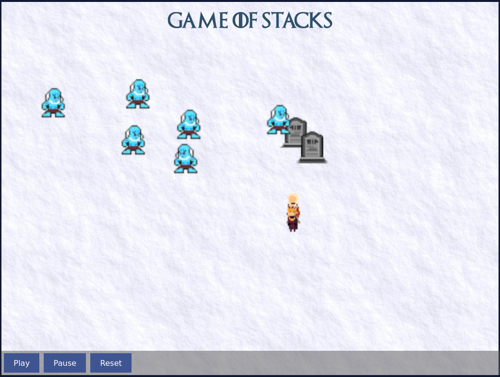
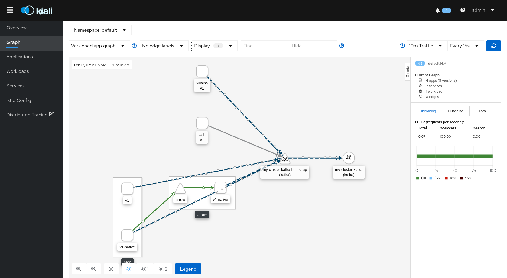
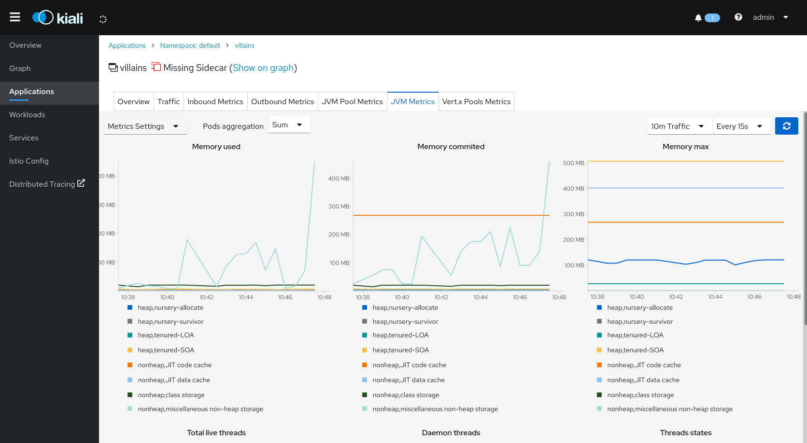

# Game of Stacks

The Game of Stacks shows the power of different stacks and VMs in the Java world (Quarkus, Vert.x ; native versus hotspot/openj9) depending on the business logic, by deploying a set of microservices in several variants and comparing their behaviours.

White walkers are coming! Winterfell is under attack! We'll try to find the best combination of heroes and weapons to defeat them!



Kiali will help us to figure out the interactions between microservices and to compare some metrics. 

| | |
| --- | --- |
|       |  |

## Running locally

### Kafka

- With docker-compose:

```bash
make start-kafka
```

- From local installation (example)

```bash
cd ~/apps/kafka_2.12-2.3.0/
bin/zookeeper-server-start.sh config/zookeeper.properties
# Open new terminal
bin/kafka-server-start.sh config/server.properties 
```

### GoS services

```bash
make clean install start-web
# then Open http://localhost:8081
make start
```


## Running on Minikube

Assuming minikube is up and running

```bash
# Deploy Strimzi/Kafka in namespace "kafka"
make deploy-kafka

# Build GoS
make clean build build-native

# Build docker images & deploy
## For docker:
make docker deploy

## For podman:
make podman deploy

# Expose (port-forward)
make expose
# Then open browser on http://localhost:8081
```

It starts with all deployments scaled to 0, except the web interface. To start the demo:

```bash
# Deploys 5 heroes (native), arrows (native), villains (oj9)
make arrow-scaling-hero-native-vs-hotspot--native

# Redeploys with 5 heroes (hotspot), arrows (native), villains (oj9)
make arrow-scaling-hero-native-vs-hotspot--hotspot

# Redeploys with 4 heroes (mix hotspot/native), arrows (native), villains (oj9)
make start-mixed

# With more villains
make more-villains start-mixed

# MUCH more villains
make much-more-villains start-mixed
```

## TODO

Next steps:
- Reintroduce catapult
- Deploy in cloud
- Differentiate sprites with text (e.g. graal/hotspot)

## Istio

kubectl label namespace default istio-injection=enabled

## Resources

- https://blog.oio.de/2020/01/13/high-performance-at-low-cost-choose-the-best-jvm-and-the-best-garbage-collector-for-your-needs/

